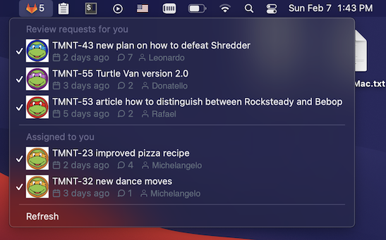
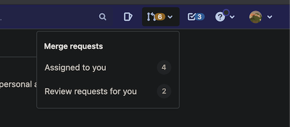

# GitLab 



This menuabar app replicates GitLab's merge requests panel dropdown:



and shows merge requests for you to review and assigned to you.

# Installation

 - download and install [Hammerspoon](https://github.com/Hammerspoon/hammerspoon/releases/latest)
 - download and install [gitLab-merge-requests.spoon](https://github.com/fork-my-spoons/gitlab-merge-requests.spoon/raw/master/gitlab-merge-requests.spoon.zip)
 - open ~/.hammerspoon/init.lua and add following snippet:

```lua
-- GitLab
hs.loadSpoon('gitlab-merge-requests')
spoon['gitlab-merge-requests']:setup({
    gitlab_host = 'https://gitlab.com',
    token = 'your_token',
    username = 'gitlab_username' 
})
```

To generate a token, go to: https://gitlab.com/-/profile/personal_access_tokens, select **api** scope and type a name.

This app uses icons, to properly display them, install a [feather-font](https://github.com/AT-UI/feather-font) by [downloading](https://github.com/AT-UI/feather-font/raw/master/src/fonts/feather.ttf) this .ttf font and installing it.
