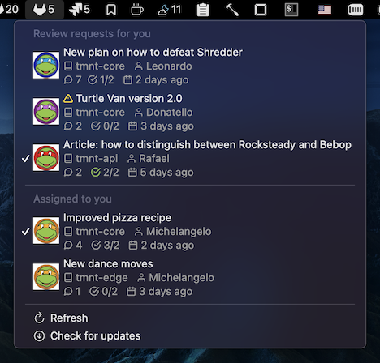

# GitLab 


A menu bar app, showing a list of merge requests assigned to a user to review:



Each item in the list is showing following information:


# Installation

 - install [Hammerspoon](http://www.hammerspoon.org/) - a powerfull automation tool for OS X
   - Manually:

      Download the [latest release], and drag Hammerspoon.app from your Downloads folder to Applications.
   - Homebrew:

      ```brew install hammerspoon --cask```

 - download [gitlab-merge-requests.spoon](https://github.com/fork-my-spoons/gitlab-merge-requests.spoon/raw/master/gitlab-merge-requests.spoon.zip), unzip and double click on a .spoon file. It will be installed under `~/.hammerspoon/Spoons` folder.
 
 - open ~/.hammerspoon/init.lua and add the following snippet, adding your parameters:

```lua
-- GitLab
hs.loadSpoon('gitlab-merge-requests')
spoon['gitlab-merge-requests']:setup({
    gitlab_host = 'https://gitlab.com',
    token = 'your_token',
    username = 'gitlab_username' 
})
```

To generate a token, go to: https://gitlab.com/-/profile/personal_access_tokens, select **api** scope and type a name.

This app uses icons, to properly display them, install a [feather-font](https://github.com/AT-UI/feather-font) by [downloading](https://github.com/AT-UI/feather-font/raw/master/src/fonts/feather.ttf) this .ttf font and installing it.
